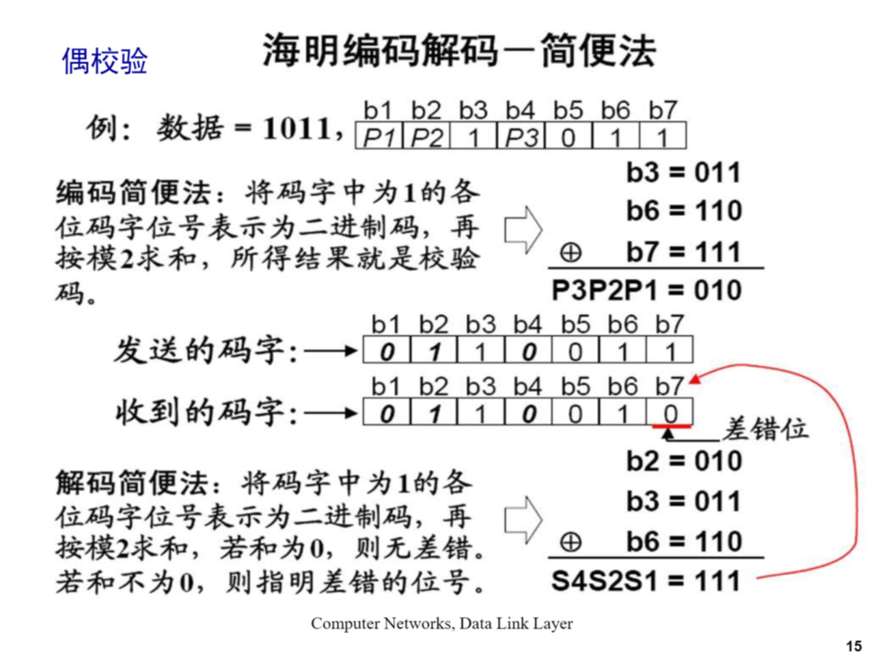

# Computer Networks Part Answers 3 - 1

<b>1.</b> An upper-layer packet is split into 10 frames, each of which has an 80% chance of arriving undamaged. 
If no error control is done by the data link protocol, how many times must the message be sent on average to get the entire thing through?

由题意可知:
一次发送成功的概率为 $ 0.8^{10} \approx 0.107 $
两次发送成功的概率为 $ (1 - 0.107) \times 0.107 $
三次发送成功的概率为 $ (1 - 0.107)^{2} \times 0.107 $
由此类推 $ k $ 次发送成功的概率为: $ (1 - 0.107)^{k} \times 0.107 $
发送次数的平均值 $ = \sum\_{k = 1}^{\infty} {k \times (1 - 0.107)^{k} \times 0.107} = \frac{1}{0.107} \approx 9 $

> 以下内容(公式的推导)更新于 2023-06-15

下面给出一个 $ \sum^{\infty}\_{i = 1} i(1 - p)^{i- 1}p $ 这个级数的求和过程:

$$
\begin{align*}
&\sum^{\infty}_{i = 1} i(1 - p)^{i- 1}p \\[0.1cm]
&= p \cdot \sum^{\infty}_{i = 1} i(1 - p)^{i- 1} \\[0.1cm]
&= p \cdot [\sum^{\infty}_{i = 1} i(1 - p)^{i- 1}]^{\prime} \\[0.1cm]
&= p \cdot [\frac{(1 - p) - (1 - p)^{\infty}}{1 - (1 - p)}]^{\prime} \\[0.1cm]
&= p \cdot (\frac{1 - p}{p})^{\prime} \\[0.1cm]
&= - \frac{1}{p}
\end{align*}
$$

值得注意的一点是, 最后推导出的结果多了一个负号, 但是以我目前的能力并不能解决这一点, 希望看到这篇文章的有缘人能够在评论区留下正确的解决办法, 鄙人不胜感激.

 

<b>2.</b> The following data fragment occurs in the middle of a data stream for which the bytestuffing algorithm described in the text is used:  
A B ESC C ESC FLAG FLAG D  
What is the output after stuffing?

填充后字符串如下所示, 其中红色的字符为填充的转义字符:
A B  ESC  ESC C  ESC  ECS  ESC  FLAG  ESC  FLAG D

 

<b>3.</b> To provide more reliability than a single parity bit can give, 
an error-detecting coding scheme uses one parity bit for checking all the odd-numbered bits and a second parity bit for all the even-numbered bits. 
What is the Hamming distance of this code?

无论是发生在奇数位上的单比特错误, 还是偶数位上的单比特错误都可以被检测出来, 但是两个比特的错误不能被检测出来, 所以这种编码的汉明距离为 2.

<b>4.</b> An 8-bit byte with binary value 10101111 is to be encoded using an even-parity Hamming code. What is the binary value after encoding?

这个题目很基础, 过程不予展示, 直接给出答案: $ 1010 0100 1111 $

> 以下内容(海明编码解码-简便法)更新于 2023-06-15. 这里插入图片有些问题, 大家可以本博客的[仓库](https://github.com/DengWuLi/DengWuLi.github.io/tree/hexo/source/_posts/ComputerNetworks/img/海明编码解码-简便法.png) 查到本图片.

 

<b>5.</b> One way of detecting errors is to transmit data as a block of <i> n </i> rows of <i> k </i> bits per row and add parity bits to each row and each column. 
The bitin the lower-right corner is a parity bit that checks its row and its column. 
Will this scheme detect all single errors? Double errors? Triple errors? Show that this scheme cannot detect some four-bit errors.

这种方法可以检查出所有单比特差错, 一个单比特差错将导致其所在的行和列都出现校验错误. 也可以检查出所有双比特差错, 即使出错的两个比特在同一行或者同一列, 也能查出.
但是, 对于 3 比特差错, 如果一个数据位错, 其对应的行列校验位均错, 则无法检测出差错. 对于 4 比特差错, 如果出错的四个点正好位于矩形的 4 个顶点, 则无法检查出差错.

 

<b>6.</b> Suppose that data are transmitted in blocks of sizes 1000 bits. 
What is the maximum error rate under which error detection and retransmission mechanism (1 parity bit per block) is better than using Hamming code? 
Assume that bit errors are independent of one another and no bit error occurs during retransmission.

根据不等式: $ m + r + 1 \leq 2^r $
可以算出 1000 位数据, 汉明码需要 10 位校验位, 即一共传输 1010 位;
而采用奇偶校验并重传的方法, 需要 1 位校验位, 出错时重传 1001 位.
假设每位出错的概率为 $ p $, 采用检错重传一共传输 $ 1001 + 1000p \times 1001 $ 位
$$ 1001 + 1000p \times 1001 < 1010 \Longrightarrow p < 8.99 \times 10^{-6} $$

<b>7.</b> What is the remainder obtained by dividing $ x^7 + x^5 + 1 $ by the generator polynomial $ x^3 + 1 $?

首先把被除数和生成多项式的系统都写成二进制位串, 被除数为 $ 10100001 $, 生成多项式为 $ 1001 $. 
然后用2除法 (对应位进行异或, 不进位也不借位), 求出余数为 $ 111$, 其对应的多项式为 $ x^2 + x + 1 $.

 

<b>8.</b> A bit stream $ 10011101 $ is transmitted using the standard CRC method described in the text. 
The generator polynomial is $ x^3 + 1 $. Show the actual bit string transmitted. Suppose that the third bit from the left is inverted during transmission. 
Show that this error is detected at the receiver’s end. Give an example of bit errors in the bit string transmitted that will not be detected by the receiver.

生成多项式的最高阶为 3, 因此先在待校验的串之后增加 3 个 0, 即 $ 1001 1101 000 $ 
然后以此位串为被除数, 生成多项式的位串 ($ 1001 $)为除数采用模 2 除法进行计算,求出余数为 $ 100 $.
实际传输位串为: $ 1001 1101 100 $
第三位反转之后的出错位串为: $ 1011 1101 100 $
因为: $ 10111101 100 \ mod \ 1001 = 100 \neq 0 $ 说明该位串有错, 因此可以检测出错误.

如果发生在左数第三位与第九位均发生了反转错误,即收到的位串为 $ 1011 1101 000 $, 此时校验的结果为 0, 即接收方无法检测出错误.

<b>9.</b> Data link protocols almost always put the CRC in a trailer rather than in a header. Why?

如果把 CRC 放在帧头, 那么在发送前要把整个帧扫描一遍来计算 CRC, 然后再从帧头开始发送, 这样每一位都要处理两次, 比较浪费时间.
把 CRC 放在帧尾, 边发送边计算校验位, 可以一次完成, 效率较高.

 

<b>10.</b> In the discussion of ARQ protocol in Section 3.3.3, 
a scenario was outlined that resulted in the receiver accepting two copies of the same frame due to a loss of acknowledgement frame. 
Is it possible that a receiver may accept multiple copies of the same frame when none of the frames (message or acknowledgement) are lost?

有可能.
接收方发出的 ACK 因为网络延迟等原因而晚于发送方计时器关闭前到达, 导致发送方认为接收方未收到此帧, 于是重传, 此种情况下, 接收方就接收到了两帧相同的帧.

<pre class="note note-info">
<strong>2023-04-18</strong> 
<strong>IP属地: 北京</strong>
</pre>
