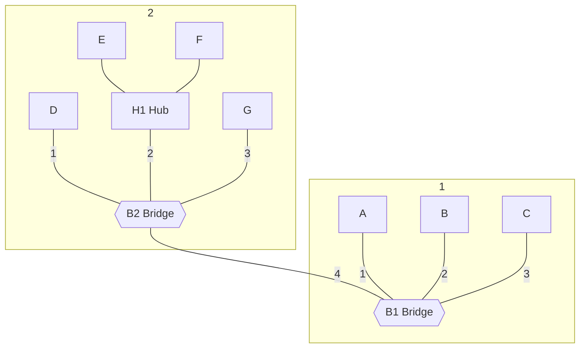

# Computer Networks Part Answers 4 - 1

<font face = "Times New Roman" size = 4>
<b>1.</b> What is the length of a contention slot in CSMA/CD for <br>
(a) a 2-km twin-lead cable (signal propagation speed is 82% of the signal propagation speed in vacuum)? <br>
(b) a 40-km multimode fiber optic cable (signal propagation speed is 65% of the signal propagation speed in vacuum)?
</font>

$$ t_1 = 2 \tau_1 = 2 \frac{2 Km}{0.82 \times 30 \times 10^4 Km/s} = 16.16 \mu s $$

$$ t_2 = 2 \tau_2 = 2 \frac{40 Km}{0.65 \times 30 \times 10^4 Km/s} = 0.41 ms $$

*本题考查课本的基础知识, 只需要记住采用 CSMA/CD 的网络中, 一个站点在开始发送数据后, 最多需要经过 $ 2 \tau $ 的时间才能发现冲突,
因此 $ 2 \tau $ 称为竞争时隙 (或争用期)*

<br>

<font face = "Times New Roman" size = 4>
<b>2.</b> Six stations, A through F, communicate using the MACA protocol. Is it possible for two transmissions to take place simultaneously? Explain your answer.
</font>

可能. 发送 RTS 的站点只要收到 CTS, 就可以无冲突发送.
假设从 A 到 F 各个站点依次排列在一条直线上 (如下图所示), 其信号覆盖范围只到自己的邻居站点, 即 A 的信号只有 B 能收到 ,
B的信号只有 A 和 C 能收到, 以此类推.
若 A 要发送数据给 B, E 要发送数据给 F, 由于 A 和 E 通过 RTS 和 CTS 都检测出没有冲突, 这两个传输可以同时发生.


<br>

<font face = "Times New Roman" size = 4>
<b>3.</b> What is the baud rate of classic 10-Mbps Ethernet?
</font>

传统的 10Mbps 以太网使用曼彻斯特编码, 它发送的每一位都有两个信号周期, 即信号频率是数据率的2倍.
数据率为 10 Mbps, 因此信号速率是 20M 波特.

<br>

<font face = "Times New Roman" size = 4>
<b>4.</b> Sketch the Manchester encoding on a classic Ethernet for the bit stream $ 0001110101 $.
</font>

如下图所示:
<div width="100%" style="overflow-x: auto;"> 
  <?xml version="1.0" encoding="utf-8" standalone="no"?>
<!DOCTYPE svg PUBLIC "-//W3C//DTD SVG 1.1//EN"
  "http://www.w3.org/Graphics/SVG/1.1/DTD/svg11.dtd">
<svg xmlns:xlink="http://www.w3.org/1999/xlink" width="460.8pt" height="345.6pt" viewBox="0 0 460.8 345.6" xmlns="http://www.w3.org/2000/svg" version="1.1">
 <metadata>
  <rdf:RDF xmlns:dc="http://purl.org/dc/elements/1.1/" xmlns:cc="http://creativecommons.org/ns#" xmlns:rdf="http://www.w3.org/1999/02/22-rdf-syntax-ns#">
   <cc:Work>
    <dc:type rdf:resource="http://purl.org/dc/dcmitype/StillImage"/>
    <dc:date>2023-04-23T12:00:18.788590</dc:date>
    <dc:format>image/svg+xml</dc:format>
    <dc:creator>
     <cc:Agent>
      <dc:title>Matplotlib v3.7.0, https://matplotlib.org/</dc:title>
     </cc:Agent>
    </dc:creator>
   </cc:Work>
  </rdf:RDF>
 </metadata>
 <defs>
  <style type="text/css">*{stroke-linejoin: round; stroke-linecap: butt}</style>
 </defs>
 <g id="figure_1">
  <g id="patch_1">
   <path d="M 0 345.6 
L 460.8 345.6 
L 460.8 0 
L 0 0 
z
" style="fill: #ffffff"/>
  </g>
  <g id="axes_1">
   <g id="patch_2">
    <path d="M 57.6 307.584 
L 414.72 307.584 
L 414.72 41.472 
L 57.6 41.472 
z
" style="fill: #ffffff"/>
   </g>
   <g id="matplotlib.axis_1">
    <g id="xtick_1">
     <g id="line2d_1">
      <defs>
       <path id="m5dc0263618" d="M 0 0 
L 0 3.5 
" style="stroke: #000000; stroke-width: 0.8"/>
      </defs>
      <g>
       <use xlink:href="#m5dc0263618" x="73.832727" y="307.584" style="stroke: #000000; stroke-width: 0.8"/>
      </g>
     </g>
     <g id="text_1">
      <!-- 0.0 -->
      <g transform="translate(65.881165 322.182437) scale(0.1 -0.1)">
       <defs>
        <path id="DejaVuSans-30" d="M 2034 4250 
Q 1547 4250 1301 3770 
Q 1056 3291 1056 2328 
Q 1056 1369 1301 889 
Q 1547 409 2034 409 
Q 2525 409 2770 889 
Q 3016 1369 3016 2328 
Q 3016 3291 2770 3770 
Q 2525 4250 2034 4250 
z
M 2034 4750 
Q 2819 4750 3233 4129 
Q 3647 3509 3647 2328 
Q 3647 1150 3233 529 
Q 2819 -91 2034 -91 
Q 1250 -91 836 529 
Q 422 1150 422 2328 
Q 422 3509 836 4129 
Q 1250 4750 2034 4750 
z
" transform="scale(0.015625)"/>
        <path id="DejaVuSans-2e" d="M 684 794 
L 1344 794 
L 1344 0 
L 684 0 
L 684 794 
z
" transform="scale(0.015625)"/>
       </defs>
       <use xlink:href="#DejaVuSans-30"/>
       <use xlink:href="#DejaVuSans-2e" x="63.623047"/>
       <use xlink:href="#DejaVuSans-30" x="95.410156"/>
      </g>
     </g>
    </g>
    <g id="xtick_2">
     <g id="line2d_2">
      <g>
       <use xlink:href="#m5dc0263618" x="114.414545" y="307.584" style="stroke: #000000; stroke-width: 0.8"/>
      </g>
     </g>
     <g id="text_2">
      <!-- 2.5 -->
      <g transform="translate(106.462983 322.182437) scale(0.1 -0.1)">
       <defs>
        <path id="DejaVuSans-32" d="M 1228 531 
L 3431 531 
L 3431 0 
L 469 0 
L 469 531 
Q 828 903 1448 1529 
Q 2069 2156 2228 2338 
Q 2531 2678 2651 2914 
Q 2772 3150 2772 3378 
Q 2772 3750 2511 3984 
Q 2250 4219 1831 4219 
Q 1534 4219 1204 4116 
Q 875 4013 500 3803 
L 500 4441 
Q 881 4594 1212 4672 
Q 1544 4750 1819 4750 
Q 2544 4750 2975 4387 
Q 3406 4025 3406 3419 
Q 3406 3131 3298 2873 
Q 3191 2616 2906 2266 
Q 2828 2175 2409 1742 
Q 1991 1309 1228 531 
z
" transform="scale(0.015625)"/>
        <path id="DejaVuSans-35" d="M 691 4666 
L 3169 4666 
L 3169 4134 
L 1269 4134 
L 1269 2991 
Q 1406 3038 1543 3061 
Q 1681 3084 1819 3084 
Q 2600 3084 3056 2656 
Q 3513 2228 3513 1497 
Q 3513 744 3044 326 
Q 2575 -91 1722 -91 
Q 1428 -91 1123 -41 
Q 819 9 494 109 
L 494 744 
Q 775 591 1075 516 
Q 1375 441 1709 441 
Q 2250 441 2565 725 
Q 2881 1009 2881 1497 
Q 2881 1984 2565 2268 
Q 2250 2553 1709 2553 
Q 1456 2553 1204 2497 
Q 953 2441 691 2322 
L 691 4666 
z
" transform="scale(0.015625)"/>
       </defs>
       <use xlink:href="#DejaVuSans-32"/>
       <use xlink:href="#DejaVuSans-2e" x="63.623047"/>
       <use xlink:href="#DejaVuSans-35" x="95.410156"/>
      </g>
     </g>
    </g>
    <g id="xtick_3">
     <g id="line2d_3">
      <g>
       <use xlink:href="#m5dc0263618" x="154.996364" y="307.584" style="stroke: #000000; stroke-width: 0.8"/>
      </g>
     </g>
     <g id="text_3">
      <!-- 5.0 -->
      <g transform="translate(147.044801 322.182437) scale(0.1 -0.1)">
       <use xlink:href="#DejaVuSans-35"/>
       <use xlink:href="#DejaVuSans-2e" x="63.623047"/>
       <use xlink:href="#DejaVuSans-30" x="95.410156"/>
      </g>
     </g>
    </g>
    <g id="xtick_4">
     <g id="line2d_4">
      <g>
       <use xlink:href="#m5dc0263618" x="195.578182" y="307.584" style="stroke: #000000; stroke-width: 0.8"/>
      </g>
     </g>
     <g id="text_4">
      <!-- 7.5 -->
      <g transform="translate(187.626619 322.182437) scale(0.1 -0.1)">
       <defs>
        <path id="DejaVuSans-37" d="M 525 4666 
L 3525 4666 
L 3525 4397 
L 1831 0 
L 1172 0 
L 2766 4134 
L 525 4134 
L 525 4666 
z
" transform="scale(0.015625)"/>
       </defs>
       <use xlink:href="#DejaVuSans-37"/>
       <use xlink:href="#DejaVuSans-2e" x="63.623047"/>
       <use xlink:href="#DejaVuSans-35" x="95.410156"/>
      </g>
     </g>
    </g>
    <g id="xtick_5">
     <g id="line2d_5">
      <g>
       <use xlink:href="#m5dc0263618" x="236.16" y="307.584" style="stroke: #000000; stroke-width: 0.8"/>
      </g>
     </g>
     <g id="text_5">
      <!-- 10.0 -->
      <g transform="translate(225.027188 322.182437) scale(0.1 -0.1)">
       <defs>
        <path id="DejaVuSans-31" d="M 794 531 
L 1825 531 
L 1825 4091 
L 703 3866 
L 703 4441 
L 1819 4666 
L 2450 4666 
L 2450 531 
L 3481 531 
L 3481 0 
L 794 0 
L 794 531 
z
" transform="scale(0.015625)"/>
       </defs>
       <use xlink:href="#DejaVuSans-31"/>
       <use xlink:href="#DejaVuSans-30" x="63.623047"/>
       <use xlink:href="#DejaVuSans-2e" x="127.246094"/>
       <use xlink:href="#DejaVuSans-30" x="159.033203"/>
      </g>
     </g>
    </g>
    <g id="xtick_6">
     <g id="line2d_6">
      <g>
       <use xlink:href="#m5dc0263618" x="276.741818" y="307.584" style="stroke: #000000; stroke-width: 0.8"/>
      </g>
     </g>
     <g id="text_6">
      <!-- 12.5 -->
      <g transform="translate(265.609006 322.182437) scale(0.1 -0.1)">
       <use xlink:href="#DejaVuSans-31"/>
       <use xlink:href="#DejaVuSans-32" x="63.623047"/>
       <use xlink:href="#DejaVuSans-2e" x="127.246094"/>
       <use xlink:href="#DejaVuSans-35" x="159.033203"/>
      </g>
     </g>
    </g>
    <g id="xtick_7">
     <g id="line2d_7">
      <g>
       <use xlink:href="#m5dc0263618" x="317.323636" y="307.584" style="stroke: #000000; stroke-width: 0.8"/>
      </g>
     </g>
     <g id="text_7">
      <!-- 15.0 -->
      <g transform="translate(306.190824 322.182437) scale(0.1 -0.1)">
       <use xlink:href="#DejaVuSans-31"/>
       <use xlink:href="#DejaVuSans-35" x="63.623047"/>
       <use xlink:href="#DejaVuSans-2e" x="127.246094"/>
       <use xlink:href="#DejaVuSans-30" x="159.033203"/>
      </g>
     </g>
    </g>
    <g id="xtick_8">
     <g id="line2d_8">
      <g>
       <use xlink:href="#m5dc0263618" x="357.905455" y="307.584" style="stroke: #000000; stroke-width: 0.8"/>
      </g>
     </g>
     <g id="text_8">
      <!-- 17.5 -->
      <g transform="translate(346.772642 322.182437) scale(0.1 -0.1)">
       <use xlink:href="#DejaVuSans-31"/>
       <use xlink:href="#DejaVuSans-37" x="63.623047"/>
       <use xlink:href="#DejaVuSans-2e" x="127.246094"/>
       <use xlink:href="#DejaVuSans-35" x="159.033203"/>
      </g>
     </g>
    </g>
    <g id="xtick_9">
     <g id="line2d_9">
      <g>
       <use xlink:href="#m5dc0263618" x="398.487273" y="307.584" style="stroke: #000000; stroke-width: 0.8"/>
      </g>
     </g>
     <g id="text_9">
      <!-- 20.0 -->
      <g transform="translate(387.35446 322.182437) scale(0.1 -0.1)">
       <use xlink:href="#DejaVuSans-32"/>
       <use xlink:href="#DejaVuSans-30" x="63.623047"/>
       <use xlink:href="#DejaVuSans-2e" x="127.246094"/>
       <use xlink:href="#DejaVuSans-30" x="159.033203"/>
      </g>
     </g>
    </g>
   </g>
   <g id="matplotlib.axis_2">
    <g id="ytick_1">
     <g id="line2d_10">
      <defs>
       <path id="m0b942d48aa" d="M 0 0 
L -3.5 0 
" style="stroke: #000000; stroke-width: 0.8"/>
      </defs>
      <g>
       <use xlink:href="#m0b942d48aa" x="57.6" y="295.488" style="stroke: #000000; stroke-width: 0.8"/>
      </g>
     </g>
     <g id="text_10">
      <!-- 0.00 -->
      <g transform="translate(28.334375 299.287219) scale(0.1 -0.1)">
       <use xlink:href="#DejaVuSans-30"/>
       <use xlink:href="#DejaVuSans-2e" x="63.623047"/>
       <use xlink:href="#DejaVuSans-30" x="95.410156"/>
       <use xlink:href="#DejaVuSans-30" x="159.033203"/>
      </g>
     </g>
    </g>
    <g id="ytick_2">
     <g id="line2d_11">
      <g>
       <use xlink:href="#m0b942d48aa" x="57.6" y="265.248" style="stroke: #000000; stroke-width: 0.8"/>
      </g>
     </g>
     <g id="text_11">
      <!-- 0.25 -->
      <g transform="translate(28.334375 269.047219) scale(0.1 -0.1)">
       <use xlink:href="#DejaVuSans-30"/>
       <use xlink:href="#DejaVuSans-2e" x="63.623047"/>
       <use xlink:href="#DejaVuSans-32" x="95.410156"/>
       <use xlink:href="#DejaVuSans-35" x="159.033203"/>
      </g>
     </g>
    </g>
    <g id="ytick_3">
     <g id="line2d_12">
      <g>
       <use xlink:href="#m0b942d48aa" x="57.6" y="235.008" style="stroke: #000000; stroke-width: 0.8"/>
      </g>
     </g>
     <g id="text_12">
      <!-- 0.50 -->
      <g transform="translate(28.334375 238.807219) scale(0.1 -0.1)">
       <use xlink:href="#DejaVuSans-30"/>
       <use xlink:href="#DejaVuSans-2e" x="63.623047"/>
       <use xlink:href="#DejaVuSans-35" x="95.410156"/>
       <use xlink:href="#DejaVuSans-30" x="159.033203"/>
      </g>
     </g>
    </g>
    <g id="ytick_4">
     <g id="line2d_13">
      <g>
       <use xlink:href="#m0b942d48aa" x="57.6" y="204.768" style="stroke: #000000; stroke-width: 0.8"/>
      </g>
     </g>
     <g id="text_13">
      <!-- 0.75 -->
      <g transform="translate(28.334375 208.567219) scale(0.1 -0.1)">
       <use xlink:href="#DejaVuSans-30"/>
       <use xlink:href="#DejaVuSans-2e" x="63.623047"/>
       <use xlink:href="#DejaVuSans-37" x="95.410156"/>
       <use xlink:href="#DejaVuSans-35" x="159.033203"/>
      </g>
     </g>
    </g>
    <g id="ytick_5">
     <g id="line2d_14">
      <g>
       <use xlink:href="#m0b942d48aa" x="57.6" y="174.528" style="stroke: #000000; stroke-width: 0.8"/>
      </g>
     </g>
     <g id="text_14">
      <!-- 1.00 -->
      <g transform="translate(28.334375 178.327219) scale(0.1 -0.1)">
       <use xlink:href="#DejaVuSans-31"/>
       <use xlink:href="#DejaVuSans-2e" x="63.623047"/>
       <use xlink:href="#DejaVuSans-30" x="95.410156"/>
       <use xlink:href="#DejaVuSans-30" x="159.033203"/>
      </g>
     </g>
    </g>
    <g id="ytick_6">
     <g id="line2d_15">
      <g>
       <use xlink:href="#m0b942d48aa" x="57.6" y="144.288" style="stroke: #000000; stroke-width: 0.8"/>
      </g>
     </g>
     <g id="text_15">
      <!-- 1.25 -->
      <g transform="translate(28.334375 148.087219) scale(0.1 -0.1)">
       <use xlink:href="#DejaVuSans-31"/>
       <use xlink:href="#DejaVuSans-2e" x="63.623047"/>
       <use xlink:href="#DejaVuSans-32" x="95.410156"/>
       <use xlink:href="#DejaVuSans-35" x="159.033203"/>
      </g>
     </g>
    </g>
    <g id="ytick_7">
     <g id="line2d_16">
      <g>
       <use xlink:href="#m0b942d48aa" x="57.6" y="114.048" style="stroke: #000000; stroke-width: 0.8"/>
      </g>
     </g>
     <g id="text_16">
      <!-- 1.50 -->
      <g transform="translate(28.334375 117.847219) scale(0.1 -0.1)">
       <use xlink:href="#DejaVuSans-31"/>
       <use xlink:href="#DejaVuSans-2e" x="63.623047"/>
       <use xlink:href="#DejaVuSans-35" x="95.410156"/>
       <use xlink:href="#DejaVuSans-30" x="159.033203"/>
      </g>
     </g>
    </g>
    <g id="ytick_8">
     <g id="line2d_17">
      <g>
       <use xlink:href="#m0b942d48aa" x="57.6" y="83.808" style="stroke: #000000; stroke-width: 0.8"/>
      </g>
     </g>
     <g id="text_17">
      <!-- 1.75 -->
      <g transform="translate(28.334375 87.607219) scale(0.1 -0.1)">
       <use xlink:href="#DejaVuSans-31"/>
       <use xlink:href="#DejaVuSans-2e" x="63.623047"/>
       <use xlink:href="#DejaVuSans-37" x="95.410156"/>
       <use xlink:href="#DejaVuSans-35" x="159.033203"/>
      </g>
     </g>
    </g>
    <g id="ytick_9">
     <g id="line2d_18">
      <g>
       <use xlink:href="#m0b942d48aa" x="57.6" y="53.568" style="stroke: #000000; stroke-width: 0.8"/>
      </g>
     </g>
     <g id="text_18">
      <!-- 2.00 -->
      <g transform="translate(28.334375 57.367219) scale(0.1 -0.1)">
       <use xlink:href="#DejaVuSans-32"/>
       <use xlink:href="#DejaVuSans-2e" x="63.623047"/>
       <use xlink:href="#DejaVuSans-30" x="95.410156"/>
       <use xlink:href="#DejaVuSans-30" x="159.033203"/>
      </g>
     </g>
    </g>
   </g>
   <g id="line2d_19">
    <path d="M 73.832727 295.488 
L 90.065455 295.488 
" clip-path="url(#pbd5a2c1914)" style="fill: none; stroke: #ff0000; stroke-width: 1.5; stroke-linecap: square"/>
   </g>
   <g id="line2d_20">
    <path d="M 90.065455 295.488 
L 90.065455 53.568 
" clip-path="url(#pbd5a2c1914)" style="fill: none; stroke: #ff0000; stroke-width: 1.5; stroke-linecap: square"/>
   </g>
   <g id="line2d_21">
    <path d="M 90.065455 53.568 
L 106.298182 53.568 
" clip-path="url(#pbd5a2c1914)" style="fill: none; stroke: #ff0000; stroke-width: 1.5; stroke-linecap: square"/>
   </g>
   <g id="line2d_22">
    <path d="M 106.298182 295.488 
L 122.530909 295.488 
" clip-path="url(#pbd5a2c1914)" style="fill: none; stroke: #ff0000; stroke-width: 1.5; stroke-linecap: square"/>
   </g>
   <g id="line2d_23">
    <path d="M 122.530909 295.488 
L 122.530909 53.568 
" clip-path="url(#pbd5a2c1914)" style="fill: none; stroke: #ff0000; stroke-width: 1.5; stroke-linecap: square"/>
   </g>
   <g id="line2d_24">
    <path d="M 122.530909 53.568 
L 138.763636 53.568 
" clip-path="url(#pbd5a2c1914)" style="fill: none; stroke: #ff0000; stroke-width: 1.5; stroke-linecap: square"/>
   </g>
   <g id="line2d_25">
    <path d="M 138.763636 295.488 
L 154.996364 295.488 
" clip-path="url(#pbd5a2c1914)" style="fill: none; stroke: #ff0000; stroke-width: 1.5; stroke-linecap: square"/>
   </g>
   <g id="line2d_26">
    <path d="M 154.996364 295.488 
L 154.996364 53.568 
" clip-path="url(#pbd5a2c1914)" style="fill: none; stroke: #ff0000; stroke-width: 1.5; stroke-linecap: square"/>
   </g>
   <g id="line2d_27">
    <path d="M 154.996364 53.568 
L 171.229091 53.568 
" clip-path="url(#pbd5a2c1914)" style="fill: none; stroke: #ff0000; stroke-width: 1.5; stroke-linecap: square"/>
   </g>
   <g id="line2d_28">
    <path d="M 171.229091 53.568 
L 187.461818 53.568 
" clip-path="url(#pbd5a2c1914)" style="fill: none; stroke: #ff0000; stroke-width: 1.5; stroke-linecap: square"/>
   </g>
   <g id="line2d_29">
    <path d="M 187.461818 53.568 
L 187.461818 295.488 
" clip-path="url(#pbd5a2c1914)" style="fill: none; stroke: #ff0000; stroke-width: 1.5; stroke-linecap: square"/>
   </g>
   <g id="line2d_30">
    <path d="M 187.461818 295.488 
L 203.694545 295.488 
" clip-path="url(#pbd5a2c1914)" style="fill: none; stroke: #ff0000; stroke-width: 1.5; stroke-linecap: square"/>
   </g>
   <g id="line2d_31">
    <path d="M 203.694545 53.568 
L 219.927273 53.568 
" clip-path="url(#pbd5a2c1914)" style="fill: none; stroke: #ff0000; stroke-width: 1.5; stroke-linecap: square"/>
   </g>
   <g id="line2d_32">
    <path d="M 219.927273 53.568 
L 219.927273 295.488 
" clip-path="url(#pbd5a2c1914)" style="fill: none; stroke: #ff0000; stroke-width: 1.5; stroke-linecap: square"/>
   </g>
   <g id="line2d_33">
    <path d="M 219.927273 295.488 
L 236.16 295.488 
" clip-path="url(#pbd5a2c1914)" style="fill: none; stroke: #ff0000; stroke-width: 1.5; stroke-linecap: square"/>
   </g>
   <g id="line2d_34">
    <path d="M 236.16 53.568 
L 252.392727 53.568 
" clip-path="url(#pbd5a2c1914)" style="fill: none; stroke: #ff0000; stroke-width: 1.5; stroke-linecap: square"/>
   </g>
   <g id="line2d_35">
    <path d="M 252.392727 53.568 
L 252.392727 295.488 
" clip-path="url(#pbd5a2c1914)" style="fill: none; stroke: #ff0000; stroke-width: 1.5; stroke-linecap: square"/>
   </g>
   <g id="line2d_36">
    <path d="M 252.392727 295.488 
L 268.625455 295.488 
" clip-path="url(#pbd5a2c1914)" style="fill: none; stroke: #ff0000; stroke-width: 1.5; stroke-linecap: square"/>
   </g>
   <g id="line2d_37">
    <path d="M 268.625455 295.488 
L 284.858182 295.488 
" clip-path="url(#pbd5a2c1914)" style="fill: none; stroke: #ff0000; stroke-width: 1.5; stroke-linecap: square"/>
   </g>
   <g id="line2d_38">
    <path d="M 284.858182 295.488 
L 284.858182 53.568 
" clip-path="url(#pbd5a2c1914)" style="fill: none; stroke: #ff0000; stroke-width: 1.5; stroke-linecap: square"/>
   </g>
   <g id="line2d_39">
    <path d="M 284.858182 53.568 
L 301.090909 53.568 
" clip-path="url(#pbd5a2c1914)" style="fill: none; stroke: #ff0000; stroke-width: 1.5; stroke-linecap: square"/>
   </g>
   <g id="line2d_40">
    <path d="M 301.090909 53.568 
L 317.323636 53.568 
" clip-path="url(#pbd5a2c1914)" style="fill: none; stroke: #ff0000; stroke-width: 1.5; stroke-linecap: square"/>
   </g>
   <g id="line2d_41">
    <path d="M 317.323636 53.568 
L 317.323636 295.488 
" clip-path="url(#pbd5a2c1914)" style="fill: none; stroke: #ff0000; stroke-width: 1.5; stroke-linecap: square"/>
   </g>
   <g id="line2d_42">
    <path d="M 317.323636 295.488 
L 333.556364 295.488 
" clip-path="url(#pbd5a2c1914)" style="fill: none; stroke: #ff0000; stroke-width: 1.5; stroke-linecap: square"/>
   </g>
   <g id="line2d_43">
    <path d="M 333.556364 295.488 
L 349.789091 295.488 
" clip-path="url(#pbd5a2c1914)" style="fill: none; stroke: #ff0000; stroke-width: 1.5; stroke-linecap: square"/>
   </g>
   <g id="line2d_44">
    <path d="M 349.789091 295.488 
L 349.789091 53.568 
" clip-path="url(#pbd5a2c1914)" style="fill: none; stroke: #ff0000; stroke-width: 1.5; stroke-linecap: square"/>
   </g>
   <g id="line2d_45">
    <path d="M 349.789091 53.568 
L 366.021818 53.568 
" clip-path="url(#pbd5a2c1914)" style="fill: none; stroke: #ff0000; stroke-width: 1.5; stroke-linecap: square"/>
   </g>
   <g id="line2d_46">
    <path d="M 366.021818 53.568 
L 382.254545 53.568 
" clip-path="url(#pbd5a2c1914)" style="fill: none; stroke: #ff0000; stroke-width: 1.5; stroke-linecap: square"/>
   </g>
   <g id="line2d_47">
    <path d="M 382.254545 53.568 
L 382.254545 295.488 
" clip-path="url(#pbd5a2c1914)" style="fill: none; stroke: #ff0000; stroke-width: 1.5; stroke-linecap: square"/>
   </g>
   <g id="line2d_48">
    <path d="M 382.254545 295.488 
L 398.487273 295.488 
" clip-path="url(#pbd5a2c1914)" style="fill: none; stroke: #ff0000; stroke-width: 1.5; stroke-linecap: square"/>
   </g>
   <g id="patch_3">
    <path d="M 57.6 307.584 
L 57.6 41.472 
" style="fill: none; stroke: #000000; stroke-width: 0.8; stroke-linejoin: miter; stroke-linecap: square"/>
   </g>
   <g id="patch_4">
    <path d="M 414.72 307.584 
L 414.72 41.472 
" style="fill: none; stroke: #000000; stroke-width: 0.8; stroke-linejoin: miter; stroke-linecap: square"/>
   </g>
   <g id="patch_5">
    <path d="M 57.6 307.584 
L 414.72 307.584 
" style="fill: none; stroke: #000000; stroke-width: 0.8; stroke-linejoin: miter; stroke-linecap: square"/>
   </g>
   <g id="patch_6">
    <path d="M 57.6 41.472 
L 414.72 41.472 
" style="fill: none; stroke: #000000; stroke-width: 0.8; stroke-linejoin: miter; stroke-linecap: square"/>
   </g>
  </g>
 </g>
 <defs>
  <clipPath id="pbd5a2c1914">
   <rect x="57.6" y="41.472" width="357.12" height="266.112"/>
  </clipPath>
 </defs>
</svg>
</div>

我自己还写了一个 python 小程序, 用来画这种编码.

```python
import matplotlib.pyplot as plt

data = "0001110101"
basicPoint = [0, 0]
points = [[]]
dirt0 = [(0, 0), (1, 0), (1, 2), (2, 2)]
dirt1 = [(0, 2), (1, 2), (1, 0), (2, 0)]

for bit in data:
    if bit == '0':
        for d in dirt0:
            points.append([basicPoint[0] + d[0], basicPoint[1] + d[1]])
    else:
        for d in dirt1:
            points.append([basicPoint[0] + d[0], basicPoint[1] + d[1]])
    basicPoint[0] = basicPoint[0] + 2

for i in range(1, len(points) - 1):
    if i % 4 != 0:
        plt.plot([points[i][0], points[i + 1][0]], [points[i][1], points[i + 1][1]], color='red')
plt.savefig('.svg', format='svg', dpi=150)  # 输出
plt.show()
```

其实就是将每个点描出来, 并填充上线段.

<br>

<font face = "Times New Roman" size = 4>
<b>5.</b> A 1-km-long, 10-Mbps CSMA/CD LAN (not 802.3) has a propagation speed of 200 m/μsec. 
Repeaters are not allowed in this system. Data frames are 256 bits long, including 32 bits of header, checksum, and other overhead. 
The first bit slot after a successful transmission is reserved for the receiver to capture the channel in order to send a 32-bit acknowledgement frame. 
What is the effective data rate, excluding overhead, assuming that there are no collisions?
</font>

单程传播时延 $ \tau =1000 / 200 = 5 \mu s $. 在没有冲突的情况下, 一次成功传输包含下列过程:

1. 发送站发出一帧, 发送时间为 $ t_1 = 256 / 10M = 25.6 \mu s $
2. 该数据帧经过 $ t_2 = \tau = 5 \mu s$ 后到达接收站
3. 接收站用 $ t_3 = 10 \mu s $ 捕获信道, 发送 ACK 帧, 发送时间 $ t_4 = 32 / 10M = 3.2 \mu s $, ACK 经过 $ t_5 = \tau = 5
   \mu s $ 后到达发送站.

因此传输总时间 $ t_总 = 25.6 + 5 + 10 + 3.2 + 5 = 48.8 \mu s $, 有效数据率 $ \eta = (256-32) / 48.8 = 4.59 Mbps $

<br>

<font face = "Times New Roman" size = 4>
<b>6.</b> Consider building a CSMA/CD network running at 1 Gbps over a 1-km cable with no repeaters. 
The signal speed in the cable is 200,000 km/sec. What is the minimum frame size?
</font>

对于 1km 电缆,单程传播时延 $ \tau = 1 / 200000 = 5 \mu s $, 往返时延为 $ 2 \tau = 10 \mu s $,
即最短帧的发送时间不能小于 $ 10 \mu s $
对于 1Gbps 的发送速率, $ 10 \mu s $ 可以发送的比特数为 $ 10 \times 10^{-6} \times 10^9 = 10^4 bits $
因此最短帧长是 $ 10000 \\; bits $, 即 $ 1250 \\; bytes $.

<br>

<font face = "Times New Roman" size = 4>
<b>7.</b> An IP packet to be transmitted by Ethernet is 60 bytes long, including all its headers. 
If LLC is not in use, is padding needed in the Ethernet frame, and if so, how many bytes?
</font>

以太网的最短以太帧有 64 bytes, 其中帧头的目的地址, 源地址, 类型, 长度字段和帧尾的校验和字段一共是 18 bytes, 数据部分最少为
46 bytes, 如果不足 46 bytes 则需要填充.
题目中的 IP 包为 60 bytes, 超过了46 bytes. 因此不需要填充.

以太网帧构成:
| Preamble | Destination Address | Source Address | Type  |  Data  |  Pad  | Checksum |
| :------: | :-----------------: | :------------: | :---: | :----: | :---: | :------: |
|    8     |          6          |       6        |   2   | 0~1500 | 0~46  |    4     |

感觉答案没有说 "Preamble" 也不知道为什么.

<br>

<font face = "Times New Roman" size = 4>
<b>8.</b> Ethernet frames must be at least 64 bytes long to ensure that the transmitter is still going in the event of a collision at the far end of the cable. 
Fast Ethernet has the same 64-byte minimum frame size but can get the bits out ten times faster. 
How is it possible to maintain the same minimum frame size?
</font>

标准答案:
快速以太网的速率是传统以太网的 10 倍, 但保留了传统以太网的最短帧长的规定, 这是通过限制电缆最大长度来实现的,
快速以太网的最大电缆长度是传统以太网的 1/10.

我的答案:
方法一: 载波扩充, 让硬件在普通的帧后面增加一些填充位, 将帧的长度扩充到 512 字节, 并由接收方硬件去掉后提交给上层
方法二: 帧突发, 允许发送方将多个待发送帧级连在一起, 一次传输出去.

我的解题思路应该是偏离的题意......

<br>

<font face = "Times New Roman" size = 4>
<b>9.</b> How many frames per second can gigabit Ethernet handle? 
Think carefully and take into account all the relevant cases. 
Hint: the fact that it is gigabit Ethernet matters.
</font>

当使用 "帧突发" 时, 每帧的大小为 64 bytes, 可处理的帧个数为 1953125;
当使用 "载波扩充" 时, 每帧的大小为 512 bytes, 可处理的帧个数为 244140;
最大帧发送时, 每帧大小为 1518 bytes, 可处理的帧个数为 82345.

<br>

<font face = "Times New Roman" size = 4>
<b>10.</b> In following figure, four stations, A, B, C, and D, are shown. Which of the last two stations do you think is closest to A and why?
</font>


```txt
     +-----+                 +-----------------------------------------+
A:   | RTS |                 |                   Data                  |
  ---+-----+-----------------+-----------------------------------------+---------------------------
           .
           .   +-----+                                                         +-----+
B:         .   | CTS |                                                         | ACK |
  ---------.---+-----+---------------------------------------------------------+-----+-------------
           .         .                                                               .
           +---------.---------------------------------------------------------------+
C:         |         .                         NAV                                   |
  ---------+---------.---------------------------------------------------------------+-------------
                     .                                                               .
                     +---------------------------------------------------------------+
D:                   |                            NAV                                | 
  -----------------------------------------------------------------------------------+-------------

                                            Time   ------>
```

站点 C 离 A 更近
因为 C 能收到 A 的 RTS 帧, 并且通过 NAV (网络分配向量) 做出相应. D 的 NAV 不包括 RTS 的时间, 说明 D 没有收到 RTS 帧, 即 D 位于 A 的无线信号覆盖范围之外.

<font face = "Times New Roman" size = 4>
<b>11.</b> Give an example to show that the RTS/CTS in the 802.11 protocol is a little different than in the MACA protocol.
</font>

由于 NAV, 802.11 的 RTS/CTS 不能解决暴露站的问题.
例如, 在教材图 4-11 的情景 (B), MACA 协议将允许两对主机同时通信, 即 B 发送给到 A 和 C 发送给 D; 但 802.11 中, C 收到 B 发送的 RTS, 根据 NAV, 它将在 B 的数据帧传输的整个过程中 (包括传输 ACK) 退避, 而不能发送给 D.

<br>

<font face = "Times New Roman" size = 4>
<b>12.</b> A wireless LAN with one AP has 10 client stations. 
Four stations have data rates of 6 Mbps, four stations have data rates of 18 Mbps, and the last two stations have data rates of 54 Mbps. 
What is the data rate experienced by each station when all ten stations are sending data together, and <br>
(a) TXOP is not used? <br>
(b) TXOP is used? <br>
</font>

1. 不使用 TXOP 时, 每个站点在占用信道时只发送一个数据帧, 该帧的发送时间可归一化为 1 / 数据率, 因此每个站点得到相同的平均数据率, 即 $ \frac{1}{\frac{4}{6} + \frac{4}{18} + \frac{2}{54}} = \frac{54}{50} = 1.08 Mbps $

2. 使用 TXOP 时, 每个站点按照平均分配时间来占用信道, 即每个站点占用 1/10 信道, 所以每个设备的传输速率都变为原来的 1/10.

<br>

<font face = "Times New Roman" size = 4>
<b>13.</b> Consider the extended LAN connected using bridges B1 and B2 in Fig. 4-41(b). Suppose the hash tables in the two bridges are empty. 
List all ports on which a packet will be forwarded for the following sequence of data transmissions: <br>
(a) A sends a packet to C. <br>
(b) E sends a packet to F. <br>
(c) F sends a packet to E. <br>
(d) G sends a packet to E. <br>
(e) D sends a packet to A. <br>
(f) B sends a packet to F. <br>
</font>

*使用 mermaid 绘制的图, 结果不尽人意, 将就着看一下吧*



1. B1 将这个数据帧转发到端口 2, 3 和 4, B2 将转发到端口 1, 2 和 3.
2. B2 将这个数据帧转发到端口 1, 3 和 4, B1 将转发到端口 1, 2 和 3.
3. B2 不转发该帧, 因此 B1 不会收到这个帧.
4. B2 将这个数据帧转发到端口 2, B1 不会收到这个帧.
5. B2 将这个数据帧转发到端口 4, B1 将转发到端口 1.
6. B1 将这个数据帧转发到端口 1, 3 和 4, B2 将转发到端口 2.

此题考查对于网桥工作原理 (如何转发帧, 如何生成转发表) 的理解.
一般来说, 网桥收到一帧后, 根据帧中的目的地址检查转发表, 如果查到的输出端口与输入端口一致, 则不转发; 如果输出端口与输入端口不一致, 则转发到相应端口; 如果查不到, 则洪泛转发到除输入端口之外的所有端口.
转发表采用 "逆向学习" 的方法生成, 即检查收到的帧中的源地址, 将源地址和输入端口加入转发表.
更加具体的内容, 可以参考课本.

<br>

<font face = "Times New Roman" size = 4>
<b>14.</b> Store-and-forward switches have an advantage over cut-through switches with respect to damaged frames. Explain what it is.
</font>

存储 - 转发型交换机首先要接收完整的数据帧, 进行校验, 然后再转发. 如果校验出错, 就立即丢弃这个数据帧而不进行转发.
对于直通型方式, 交换机在收到帧头的目的地址之后, 即开始转发该帧, 边转发边校验, 因而即使发现了校验错误, 也为时晚矣, 损坏帧将无法丢弃, 依然在网络中传输.

<pre class="note note-info">
<strong>2023-04-25</strong> 
<strong>IP属地: 北京</strong>
</pre>