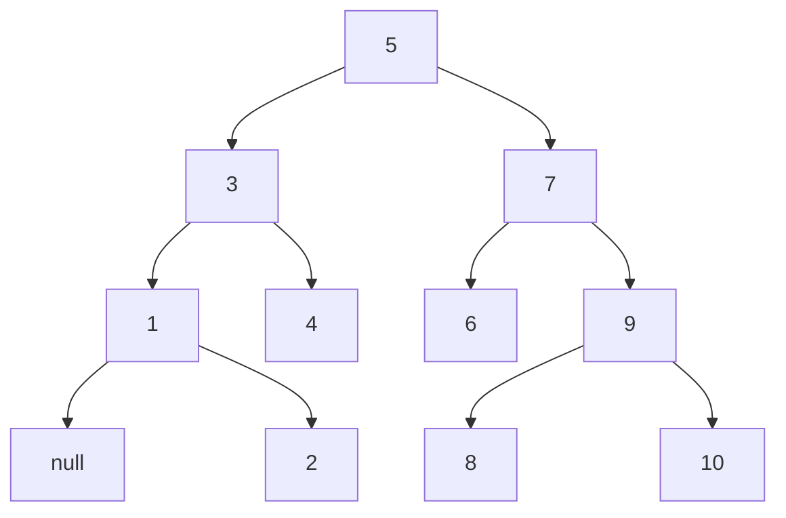

# 手撕BST

## 题目描述: 
对一棵初始为空的二叉查找树 (Binary Search Tree, BST) 进行若干插入或删除操作, 请输出最后的二叉查找树.



## 输入:
输入第一行为一个整数 $ T $, 表示操作数目. 随后 $ T $ 行,每行为 `Insert K` (表示插入整数K) 或 `Remove K` (表示删除整数K).
$ T $ 不超过 $ 2 \times 10^5 $, 树高不超过 $ 10^4 $. 

## 输出:
输出经上述操作后得到的二叉查找树的中根序列和先根序列, 序列中每个整数后一个空格 (**包括最后一个**), 两个序列之间用空行间隔 (**最后也要有个空行**).

## 输入样例:
```txt
16
Insert 17
Insert 31
Insert 13
Insert 11
Insert 20
Insert 35
Insert 25
Insert 8
Insert 4
Insert 11
Insert 24
Insert 40
Insert 27
Insert 9
Remove 17
Remove 13
```

## 输出样例:
```txt
4 8 9 11 20 24 25 27 31 35 40 

20 11 8 4 9 31 25 24 27 35 40 
```

## C++
```cpp
// 2023/04/21
// 手撕BST
// 应 Mar-Bro 要求写的

#include <cstdio>
#include <cstring>
#include <iostream>
#include <vector>

struct Node {
    int data;
    Node *left, *right;
    explicit Node(const int& data) {
        left = right = nullptr;
        this->data = data;
    }
};

class BSTree {
private:
    Node* root = nullptr;

public:
    BSTree() = default;

    explicit BSTree(const int& data) {
        root = new Node(data);
    }

    ~BSTree() {
        destroy(root);
    }

    bool insert(const int& data) {
        if (root == nullptr) {
            root = new Node(data);
            return true;
        }

        Node *parent = nullptr, *cur = root;
        while (cur != nullptr) {
            if (cur->data < data) {
                parent = cur;
                cur = cur->right;
            }
            else if (cur->data > data) {
                parent = cur;
                cur = cur->left;
            }
            else   // 不允许插入相同的 data, 这一点可以从测试样例看出来
                return false;
        }

        cur = new Node(data);
        if (parent->data > data)
            parent->left = cur;
        else
            parent->right = cur;
        return true;
    }

    bool remove(const int& data) {
        Node *parent = nullptr,
             *cur = root;

        while (cur != nullptr) {
            if (cur->data > data) {
                parent = cur;
                cur = cur->left;
            }
            else if (cur->data < data) {
                parent = cur;
                cur = cur->right;
            }
            else {
                // data 的左子树为空, 所以父节点链接右子树
                if (cur->left == nullptr) {
                    // 如果删除的是根节点, 此时父节点指向 nullptr
                    if (parent == nullptr)
                        root = root->right;   // 注意因为不是对 root 的引用, 所以需要直接修改 root 节点
                    else {
                        // 判断应该链接到父节点左还是右
                        if (cur == parent->left)
                            parent->left = cur->right;
                        else
                            parent->right = cur->right;
                    }
                    delete cur;
                }
                // data 的右子树为空, 所以父节点链接左子树
                else if (cur->right == nullptr) {
                    // 如果删除的是根节点, 此时父节点指向 nullptr
                    if (parent == nullptr)
                        root = root->left;   // 注意因为不是对 root 的引用, 所以需要直接修改 root 节点
                    else {
                        // 判断应该链接到父节点左还是右
                        if (cur == parent->left)
                            parent->left = cur->left;
                        else
                            parent->right = cur->left;
                    }
                    delete cur;
                }
                // 左右子树均不为空, 使用左子树的最大节点或者右子树的最小节点进行替换
                // 此处选择用 右子树的最小节点进行替换
                else {
                    auto minNodeParent = cur;
                    auto minNode = cur->right;

                    while (minNode->left != nullptr) {
                        minNodeParent = minNode;
                        minNode = minNode->left;
                    }

                    std::swap(cur->data, minNode->data);
                    // 解决野指针或 minNode->right 有子树的情况
                    // minNodeParent->left = minNode->right

                    if (minNodeParent->left == minNode)
                        minNodeParent->left = minNode->right;
                    else
                        minNodeParent->right = minNode->right;
                    delete minNode;
                }
                return true;
            }
        }
        return false;
    }

    // 先序遍历
    std::vector<int> preOrder() {
        auto res = std::vector<int>();
        preOrder(this->root, res);
        return res;
    }

    // 中序遍历
    std::vector<int> inOrder() {
        auto res = std::vector<int>();
        inOrder(this->root, res);
        return res;
    }

private:
    static void destroy(Node* root) {
        if (root == nullptr) {
            delete (root->left);
            delete (root->right);
            delete root;
        }
    }

    void inOrder(const Node* root, std::vector<int>& res) {
        if (root != nullptr) {
            if (root->left != nullptr)
                inOrder(root->left, res);
            res.push_back(root->data);
            if (root->right != nullptr)
                inOrder(root->right, res);
        }
    }

    void preOrder(const Node* root, std::vector<int>& res) {
        if (root != nullptr) {
            res.push_back(root->data);
            if (root->left != nullptr)
                preOrder(root->left, res);
            if (root->right != nullptr)
                preOrder(root->right, res);
        }
    }
};

using std::cin;
using std::cout;
using std::endl;

int main() {
    int T, data;
    cin >> T;
    BSTree root;
    char order[7];
    for (int i = 0; i < T; i++) {
        scanf("%s %d", order, &data);
        if (std::strcmp(order, "Insert") == 0)
            root.insert(data);
        if (std::strcmp(order, "Remove") == 0)
            root.remove(data);
    }

    size_t size;
    auto inOrder = root.inOrder();
    size = inOrder.size();
    for (int i = 0; i < size; i++)
        cout << inOrder[i] << ' ';


    auto preOrder = root.preOrder();
    size = preOrder.size();
    cout << endl
         << endl;
    for (int i = 0; i < size; i++)
        cout << preOrder[i] << ' ';

    cout << endl;
}
```

## 写在最后
本答案是应 **Mao-Bro** 写的答案题解.
Mro-Bro 是来自 JLU 的高材生, 因为近期课业繁忙, 不得不出此下策让我替他写几道题.
不过也好, 正好锻炼一下我的编码能力. 如果有兴趣, 大家可以在 [GitHub](https://github.com/mar-bro) 上关注一下他.
为了保护他的个人隐私, 这里就不贴他的照片了.

*今个是破题, 文章还在后头呢*
<pre class="note note-info">
<strong>2023-04-21</strong> 
<strong>IP属地: 北京</strong>
</pre>