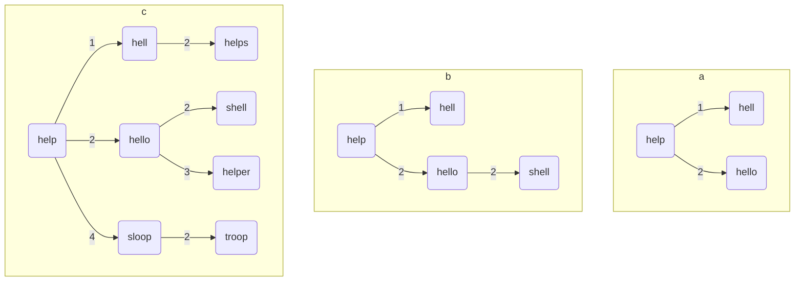

# 自动纠错

## 题目描述: 
百度, 谷歌等搜索引擎, 以及 Word 等文字处理软件往往包含这样一个功能: 当用户输入了错误的单词时, 系统能够自动识别并向用户建议正确的单词. 这个功能是如何实现的呢? 一种典型的实现方法是: 系统后台维护一个 "字典", 当用户输入的单词不在字典中时, 则认为是错误的单词, 并在字典中查找与用户所输单词相似度高且用户使用频率高的单词, 向用户建议.

*原题目处有个图片, 此处为节约资源, 不予展示*

采用 "距离" 衡量两个单词的相似度. 两个字符串的距离定义为一个字符串转化成另一个字符串, 所需的最少 "操作" 次数. 有三种操作: 增加一个字符, 删除一个字符, 替换一个字符. 显然, 距离越大, 说明两个字符串的相似程度越小; 距离越小, 说明两个字符串的相似程度越大. 对于两个完全相同的字符串, 距离为 0.


例如将 `FOOD` 转换成 `MONEY`, 最少通过如下 4 步操作: 第 1 位 `F` 替换为 `M`, 第 3 位 `O` 替换为`N`, 在第 4 位插入 `E`, 第`5`位 `D` 替换为 `Y`. 故 `FOOD` 和 `MONDY` 的距离为 4.

|       |       |       |        |       |
| :---: | :---: | :---: | :----: | :---: |
|   F   |   O   |   O   | &emsp; |   D   |
|   M   |   O   |   N   |   E    |   Y   |

这样, 当用户输入错误单词后, 则系统可以在字典中查找与该错误单词距离不超过 n (n 一般不超过 3) 的单词建议给用户. 字典通常包含几万个单词, 如果将用户输入单词与字典里的单词逐一比对, 显然非常耗时. 一种高效的处理方法是: 结合各单词间的距离, 将字典组织成一棵多叉树. 在该树中, 每个结点表示一个单词, 对于每个结点 $ p $, 其第 $ i $ 棵子树包含与 $ p $ 的距离为 $ i $ 的所有单词对应的结点.

树的创建过程如下: 取字典中任意单词作为根结点, 比如第一个单词. 然后将剩余单词逐个插入到树中, 插入一个新单词 $ w $ 时, 首先计算该单词与根结点的距离 $ d $. 若根结点的第 $ d $ 个子树为空, 则将单词 $ w $ 对应的结点作为根结点的第 $ d $ 个子结点. 若根结点的第 $ d $ 个子树非空, 即根结点已有第 $ d $ 个子结点 $ p_d $. 则按上述规则将单词 $ w $ 递归插入以 $ p_d $ 为根的子树, 即计算 $ w $ 与 $ p_d $ 的距离......

例如字典为 `{help, hell, hello, shell, helper, sloop, helps, troop}`, 将 `help` 作为根结点, 然后将 `hell` 插入, `hell` 与 `help` 的距离为 1, 故 `hell` 作为 `help` 的第一个子结点. `hello` 与`help` 的距离为 2, 故 `hello` 作为 `help` 的第 2 个子结点. 如下图(a)所示.


然后插入 `shell`, `shell`与 `help` 的距离为 2, 故应在 `help` 的第 2 个子树里, 但 `help` 已经有第 2 个子结点`hello` 了, 此时将 `shell` 递归插入以 `hello` 为根结点的子树: 计算 `shell` 与 `hello` 的距离为 2, 将 `shell` 作为 `hello` 的第 2 个子结点, 如上图 (b) 所示. 
插入 `helper` 时, `helper` 与 `help` 的距离为 2, 将 `helper` 递归插入以 `hello` 为根结点的子树; 计算 `helper` 与 `hello` 的距离为 3, 将 `helper` 作为 `hello` 的第 3 个子结点. 以此类推, 最终上述字典对应的树结构如上图 (c) 所示. 该树结构保证与任意结点距离为 d 的单词都在该结点的第 d 棵子树里.

假定我们需要向用户返回与错误单词距离不超过 $ n $ 的单词, 当用户输入一个单词 $ w $ 时, 在树中查询 $ w $, 计算 $ w $ 与根结点 $ T $ 的距离 $ d $, 接下来我们不必考察 $ T $ 的所有子树中是否包含与 $ w $ 距离不超过 $ n $ 的结点/单词, 而只需要递归考察根结点 $ T $ 的第 $ d - n $ 到第 $ d + n $ 棵子树即可. 例如: $ n = 1, d = 5 $, 我们只需要递归考察根 T 的第 $ 4 $, 第 $ 5 $, 第 $ 6 $ 棵子树是否包含与 $ w $ 距离不超过 $ 1 $ 的结点/单词. 其他子树无需考察, 为什么呢? 举个例子, 我们考虑根 $ T $ 的第 $ 3 $ 棵子树的任意结点 $ P $. $ w $ 与 $ T $ 的距离为 $ d = 5 $, 即 $ w $ 最少经过 $ 5 $ 步操作才能转换为 $ T $, $ T $ 与 $ P $ 的距离为 $ 3 $, $ T $ 经过最少 $ 3 $ 步操作才能变为 $ P $, 这意味着 $ w $ 至少需要 $ 2 $ 步操作才能变为 $ P $. 不可能通过 $ 1 $ 步操作变为 $ P $. 故第 $ 3 $ 棵子树的所有结点都不满足条件.

$$ w \stackrel{5}{\longrightarrow} T \stackrel{3}{\longrightarrow} P $$

由于 $ n $ 通常很小, 因此该方法在查询时往往可以排除很多子树, 进而节省时间. 当考察一个结点时, 计算 $ w $ 与该结点的距离 $ d $; 若 $ d = 0 $, 意味着用户输入的单词 $ w $ 在字典中, 是正确的单词; 若 $ d > n $ 则该结点不是候选单词, 继续递归考察该结点第 $ d - n $到 $ d + n $ 的子树. 若 $ d \leq n $ 则该结点就是候选单词之一, 此时可有两种策略, 一是将该单词直接返回给用户, 二是继续向下考察子树, 找出所有候选单词并选择用户历史使用频率最高的单词返回给用户.

在本题中, 请你编写程序实现上述功能.

## 输入格式:
输入第 $ 1 $ 行为 $ 3 $ 个正整数 $ n, m, d $. $ n $ 为字典中单词个数. $ m $为用户查询数, 即用户输入的单词个数. 对于用户输入的每个错误单词, 程序需要返回与错误单词距离不超过 $ d $ 的单词. 接下来 $ n $ 行, 表示字典信息, 字典包含$ n $ 个单词及其历史使用频率. 每行为 $ 1 $ 个整数和一个由字母组成的字符串, 整数表示单词的历史使用频率, 字符串表示单词. 接下来 $ m $ 行, 表示用户的查询, 每行一个字母组成的字符串, 表示用户输入的单词. ($ n \leq 10000, m \leq 1000, d \leq 2 $, 每个单词长度不超过 $ 15 $, 单词历史使用频率小于 $ 2^{31} $)

## 输出格式:
对于用户输入的每个单词, 若该单词正确 (其在字典中), 则直接输出该单词; 若该单词错误 (不在字典中), 则输出字典中与该单词距离不超过 $ d $ 的所有单词中历史使用频率最高的单词, 若多个满足条件的单词使用频率相等, 则返回字典序最靠前的单词;若没有满足条件的单词, 则输出 `No similar word in dictionary`.

## 输入样例:
```txt
9 8 2
327769900	my
322417800	are
302713400	me
283256900	one
282026500	their
280248100	so
264141700	an
263713600	said
250991700	them
me
wne
therr
xxxxx
they
ax
sy
sds
```

## 输出样例:
```txt
me
are
their
No similar word in dictionary
their
my
my
so
```

## C++
```cpp
// 2023/04/25
// 自动纠错
// 应 Mar-Bro 要求写的

#include <algorithm>
#include <iostream>
#include <queue>
#include <set>
#include <unordered_map>
#include <utility>
#include <vector>

using std::cin;
using std::cout;
using std::endl;
using std::max;
using std::min;
using std::priority_queue;
using std::set;
using std::sort;
using std::string;
using std::vector;

const int MAX_DISTANCE = 16;

struct Data {
    string word;
    int frequency{};

    Data() = default;

    Data(const string& word, const int& frequency) {
        this->word = word;
        this->frequency = frequency;
    }

    bool operator<(const Data& other) const { return comp(other, *this); }

    static bool comp(const Data& num1, const Data& num2) {
        if (num1.frequency != num2.frequency)
            return num1.frequency > num2.frequency;
        else
            return num1.word < num2.word;
    }
};

int distance(const string& a, const string& b) {
    int aLen = a.length(), bLen = b.length();

    if (aLen * bLen == 0) return aLen + bLen;

    vector<vector<int>> D(aLen + 1, vector<int>(bLen + 1));

    for (int i = 0; i < aLen + 1; i++)
        D[i][0] = i;
    for (int j = 0; j < bLen + 1; j++)
        D[0][j] = j;

    for (int i = 1; i < aLen + 1; i++) {
        for (int j = 1; j < bLen + 1; j++) {
            int left = D[i - 1][j] + 1;
            int down = D[i][j - 1] + 1;
            int left_down = D[i - 1][j - 1];
            if (a[i - 1] != b[j - 1]) left_down += 1;
            D[i][j] = min(left, min(down, left_down));
        }
    }
    return D[aLen][bLen];
}

struct Node {
    Data data;
    vector<Node*> child = std::move(vector<Node*>(MAX_DISTANCE));

    explicit Node(const Data& data) { this->data = data; }
};

class Tree {
private:
    Node* root = nullptr;
    int d;

public:
    explicit Tree(int d) { this->d = d; };

    ~Tree() { destroy(root); }

    void insert(const Data& data) { insert(root, data); }

    vector<Data> preOrder() {
        vector<Data> res;
        preOrder(root, res);
        return res;
    }

    string search(const string& data) {
        priority_queue<Data> ans;
        string res = "No similar word in dictionary";
        search(root, data, ans);
        if (!ans.empty())
            res = ans.top().word;

        return res;
    }

private:
    void insert(Node*& root, const Data& data) {
        if (root == nullptr) {
            root = new Node(data);
            return;
        }
        auto dist = distance(root->data.word, data.word);
        if (root->child[dist] == nullptr)
            root->child[dist] = new Node(data);
        else
            insert(root->child[dist], data);
    }

    void destroy(Node* root) {
        if (root) {
            for (auto& i : root->child)
                if (i != nullptr)
                    destroy(i);
            delete root;
        }
    }

    void preOrder(Node* root, vector<Data>& res) {
        if (root != nullptr) {
            res.push_back(root->data);
            for (auto& i : root->child)
                if (i != nullptr)
                    preOrder(i, res);
        }
    }

    void search(const Node* root, const string& data, priority_queue<Data>& ans) {
        if (root == nullptr)
            return;
        // 需要查找的字符串与根节点的距离
        auto distToRoot = distance(root->data.word, data);

        if (distToRoot <= d)
            ans.push(root->data);

        else {
            for (auto i = max(1, distToRoot - d); i <= distToRoot + d && i < MAX_DISTANCE; i++)
                if (root->child[i] != nullptr && (ans.empty() || root->child[i]->data.frequency >= ans.top().frequency))
                    search(root->child[i], data, ans);
        }
    }
};

int main() {
    int n, m, d;
    cin >> n >> m >> d;
    set<string> tab;
    auto root = Tree(d);
    for (int i = 0; i < n; i++) {
        int tempInt;
        string tempStr;
        cin >> tempInt >> tempStr;
        tab.insert(tempStr);
        root.insert({tempStr, tempInt});
    }

    for (int i = 0; i < m; i++) {
        string testStr;
        cin >> testStr;

        if (tab.find(testStr) != tab.end())
            cout << testStr << endl;
        else
            cout << root.search(testStr) << endl;
    }
}
```

## 写在最后
本答案也是应 **Mao-Bro** 写的答案题解.
一开始, 我根据题目描述写了一版代码, 结果第二个测试点超时, 百思不得其解, 于是放弃这个题目, 转头去做其他事情了.
后来, 在和 *Mao-Bro* 交流中得知, 第二个点, 如果只建树的话, 只要 $ 33 ms $, 问题一定出在搜索上.
于是, 我突然想到是否需要剪枝呢? 于是, 我将节点存储的数据由 `string` 改为了 `string int`.
同时, 在建树之前, 先对数据进行排序 (先按照使用频率降序, 再按照字符串升序). 而看测试样例发现, 测试样例的输入也是按照这种规则的, 所以把这段代码去掉.
这样建立的树, 树子节点的使用频率一定是小于根节点的. 然而, 很容易想到的一个 bug: 当用户输入一个正确的冷门单词时, 会输出一个与这个正确的单词距离最小的最热门的单词.
为了解决这个 bug, 我们先用 `set` 创建词典, 先在词典中搜索一下, 再在树中进行搜索.
此后, 在搜索中使用了优先队列, 并且当子节点的单词的使用频率小于队列头节点存储的使用频率时, 直接放弃对此子树的搜索.
 
还有关于距离的计算, 这个是听从 *Mao-Bro* 的建议使用了力扣上的同类型题目的动态规划的算法, 代替了之前自己查到的递归的写法.
<pre class="note note-info">
<strong>2023-04-25</strong> 
<strong>IP属地: 北京</strong>
</pre>